# desirepl — REPL Internals & Implementation Guide

> **For Contributors**: This document covers the REPL architecture, wrapping strategy, diagnostic rendering, and known limitations with guidance for future improvements.

---

## Table of Contents

1. [Architecture](#architecture)
2. [Source Code](#source-code)
3. [Input Wrapping Strategy](#input-wrapping-strategy)
4. [Diagnostic Rendering](#diagnostic-rendering)
5. [REPL Commands](#repl-commands)
6. [Testing](#testing)
7. [Known Limitations](#known-limitations)
8. [Future Work](#future-work)

---

## Architecture

The REPL is a **check-only** tool. It does NOT execute code — it only parses and type-checks each input line. The pipeline for each input is:

```
User Input → Wrap in function → Parse → Type Check → Display result
```



```mermaid
flowchart LR
    A["User Input"] --> B["Wrap: def __repl_N():\n\t<input>"]
    B --> C["parse.ParseFile()"]
    C -->|errors| D["Display parse errors"]
    C -->|ok| E["check.Check()"]
    E -->|diags| F["Display diagnostics"]
    E -->|clean| G["Print 'ok'"]
```

### Why check-only?

Full execution would require the LLVM backend (`emit-ir` → `llc` → `clang` → run`), which is expensive per line. The check-only approach gives sub-millisecond feedback, making it useful for:

- Validating syntax experiments
- Exploring the type system
- Debugging type errors interactively
- Teaching the language

---

## Source Code

The entire REPL is a single file:

```
compiler/cmd/desirepl/main.go
```

### Dependencies

| Package | Purpose |
|---------|---------|
| `parse` | `ParseFile()` — converts source to AST |
| `check` | `Check()` — type checking and diagnostics |
| `ast` | `Print()` — AST pretty-printer for `:ast` command |
| `diag` | `Diagnostic` struct — error/warning data |
| `term` | `Println()`, `Prompt()`, `Flush()` — terminal I/O |
| `version` | `String()` — version display |

### Build

```bash
go build -o bin/desirepl ./compiler/cmd/desirepl/
```

---

## Input Wrapping Strategy

Each user input line is wrapped in a synthetic function to satisfy the parser's expectation that statements appear inside a function body:

```go
src := fmt.Sprintf("def __repl_%d():\n\t%s\n", lineNum, line)
fileName := fmt.Sprintf("<repl:%d>", lineNum)
```

For example, `let x = 42` becomes:

```desi
def __repl_1():
	let x = 42
```

### Why this works

- The parser expects statements inside a block (function/if/for body)
- Wrapping in a function gives us a valid top-level declaration
- The `__repl_N` naming avoids collisions between lines
- The `<repl:N>` filename provides meaningful location info in diagnostics

### Where it breaks

- **Nested `def`**: `def foo(): return 42` creates a function inside the wrapper function, which fails to parse due to indentation
- **Multi-line constructs**: The REPL is line-by-line, so `if x:\n    foo()` spanning two lines won't work
- **Cross-line state**: Each line gets a fresh function scope, so variables declared on one line aren't available on the next

---

## Diagnostic Rendering

All diagnostic domains are rendered with appropriate labels:

```go
switch d.Domain {
case "type":     prefix = "type error"
case "warn":     prefix = "warning"
case "class":    prefix = "class error"
case "borrow":   prefix = "borrow error"
case "call":     prefix = "call error"
case "collections": prefix = "collection error"
case "numeric":  prefix = "numeric error"
case "ffi":      prefix = "ffi error"
case "sync":     prefix = "concurrency error"
case "module":   prefix = "module error"
case "project":  prefix = "project error"
}
```

Output format:

```
  [DTE0004] type error: cannot assign 'int' to 'str'
  [DW0001] warning: unused variable or parameter
```

### Important: No domain filtering

Previous versions only rendered `warn`, `type`, and `class` diagnostics. This was fixed to show **all** domains. If you add a new diagnostic domain, add a case to `renderDiag()`.

---

## REPL Commands

Commands are handled before wrapping/parsing:

| Command | Aliases | Behavior |
|---------|---------|----------|
| `:quit` | `:q`, `quit`, `exit` | Flush terminal and exit |
| `:help` | `:h` | Print command list |
| `:ast` | — | Set flag; next input dumps AST before checking |

The `:ast` flag is single-shot — it resets after one input (or on parse error).

---

## Testing

The REPL has no Go test files. Testing is done via piped input:

```bash
# Basic smoke test
echo 'let x = 10
print("hello")
let y: str = 42
:quit' | ./bin/desirepl

# Error recovery test
echo ')))
[[[
{{{
print("still works")
:quit' | ./bin/desirepl

# :ast test
echo ':ast
let x = 42
:quit' | ./bin/desirepl

# EOF handling
printf '' | ./bin/desirepl
```

### Test coverage checklist

- [ ] Basic `let` bindings → `ok`
- [ ] `print()` calls → `ok`
- [ ] Type mismatches → diagnostic with code ID
- [ ] Data structures (list, dict, tuple) → `ok`
- [ ] Control flow (`if`, `for`) → `ok`
- [ ] `let mut` → `ok`
- [ ] Malformed input → parse errors, no crash
- [ ] All exit commands work
- [ ] EOF exits cleanly (code 0)
- [ ] `:ast` shows AST for next input
- [ ] `:help` prints command list

---

## Known Limitations

### No cross-line state

Each line gets a fresh `__repl_N()` function, so:

```
>>> let x = 10    # ok
>>> print(x)      # ERROR: x undefined
```

**Root cause**: `check.Check()` is called independently per line. There's no shared scope.

### No code execution

The REPL doesn't run code. `print("hello")` is type-checked but not executed.

**Root cause**: Execution requires the full LLVM pipeline (`emit-ir` → `llc` → `clang`), which is too slow for line-by-line interaction.

### No multiline input

All input must fit on one line. Multiline `if`/`for`/`match` blocks don't work.

---

## Future Work

### Phase 1: Cross-line state (recommended)

To support `let x = 10` then `print(x)`:

1. Maintain a persistent `*check.Scope` across inputs
2. Accumulate all statements into a single growing function body
3. Re-check from scratch each time (or incrementally extend the scope)

```go
// Sketch:
accumulated := []string{}
for line := nextInput() {
    accumulated = append(accumulated, line)
    src := wrapAll(accumulated)
    mod, errs := parse.ParseFile(...)
    diags, _ := check.Check(mod)
    // Show only new diagnostics
}
```

### Phase 2: Execution

To actually run code:

1. Compile accumulated statements to LLVM IR
2. Use LLVM's JIT (MCJIT or OrcJIT) via CGo
3. Execute in-process without spawning `llc`/`clang`

This is a significant undertaking and would require CGo bindings to LLVM.

### Phase 3: Multiline input

Detect incomplete input (trailing `:`, unclosed brackets) and prompt for continuation:

```
>>> if x > 0:
...     print("positive")
...
ok
```

### Phase 4: readline support

Add history, tab completion, and cursor movement using a readline library like `github.com/chzyer/readline`.
