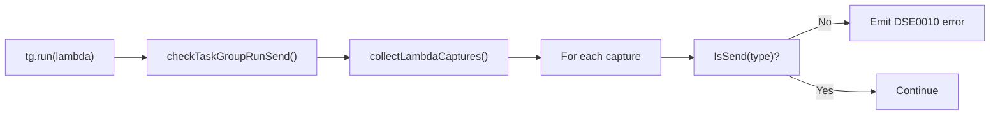

# Send Trait Verification

This document explains how Send trait verification is implemented for `tg.run()` closures.

## Overview

When a lambda with captures is passed to `TaskGroup.run()`, the compiler verifies that all captured variables implement the Send trait (are safe to transfer across thread boundaries).

```desi
let x = 42  # int is Send ✅

using tg = sync.TaskGroup():
    tg.run(lambda<none>: print(x))  # OK - x is Send
    tg.wait()
```

## Non-Send Types

```desi
using guard = mutex.lock():
    tg.run(lambda<none>: print(guard))  # ERROR: MutexGuard is not Send
```

MutexGuard cannot be sent across threads because:
- Lock ownership is tied to the acquiring thread
- Transferring would violate mutex semantics

## Implementation

### Files

| File | Purpose |
|------|---------|
| `check/check_send.go` | Send verification logic |
| `check/expr_call.go` | Integration with tg.run() type checking |
| `types/send_sync.go` | IsSend()/IsSync() trait implementations |

### Check Flow



### Error Code

**DSE0010**: "captured variable 'x' is not Send - cannot use in tg.run()"

## Send Trait Rules

| Type | Send? | Reason |
|------|-------|--------|
| int, float, bool, str | ✅ | Primitives are always Send |
| Mutex, RwLock | ✅ | Designed for cross-thread use |
| Channel, Sender, Receiver | ✅ | Thread-safe by design |
| Atomic | ✅ | Lock-free thread safety |
| list[T], set[T], dict[K,V] | ✅* | Send if elements are Send |
| MutexGuard, ReadGuard, WriteGuard | ❌ | Lock ownership tied to thread |
